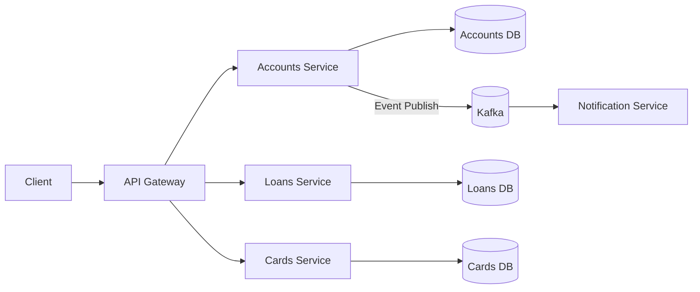
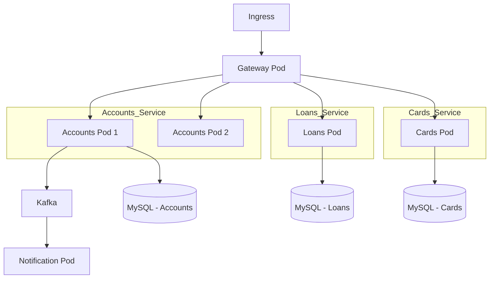

# 🚀 Enterprise Microservices Architecture – Spring Boot | Docker | Kubernetes

> Production-ready cloud-native microservices ecosystem built using Spring ecosystem, containerized with Docker and orchestrated using Kubernetes.

---

## 🏗️ Architecture Overview

### 🔹 System Architecture (Logical View)



---

### 🔹 Kubernetes Deployment View



---

# 🧠 Core Architecture Principles

- Microservices Architecture
- Database per Service Pattern
- API Gateway Pattern
- Event-Driven Architecture
- 12-Factor App Compliance
- Cloud-Native Design
- Container-First Strategy

---

# 📦 Microservices Implemented

### 1️⃣ API Gateway
- Centralized routing
- Cross-cutting concerns
- Load balancing
- Security enforcement layer

### 2️⃣ Accounts Service
- Customer account management
- Independent database
- Publishes domain events

### 3️⃣ Loans Service
- Loan processing
- Isolated schema
- Scalable independently

### 4️⃣ Cards Service
- Card management
- Separate DB
- Stateless service design

### 5️⃣ Notification Service
- Kafka consumer
- Asynchronous event handling

---

# 🔄 Request Flow

1. Client sends request to API Gateway
2. Gateway routes to respective microservice
3. Service processes business logic
4. Data stored in dedicated database
5. Domain event published to Kafka
6. Downstream services consume events asynchronously

---

# 🗄 Database Strategy

- MySQL per microservice
- No shared database schema
- Loose coupling
- Independent scaling

---

# 🔁 Event-Driven Communication

- Apache Kafka messaging
- Publisher-Subscriber model
- Asynchronous processing
- Fault-tolerant messaging

---

# 🔐 Security Architecture

- OAuth2 support
- JWT-based authentication
- Role-based authorization
- Gateway-level security filters

---

# 📊 Observability & Monitoring

- Micrometer for metrics
- Prometheus for aggregation
- Grafana dashboards
- Distributed tracing support
- Health & readiness probes

---

# 🐳 Docker Usage

## Build JAR

```bash
mvn clean install -Dmaven.test.skip=true
```

## Run Spring Boot App

```bash
mvn spring-boot:run
```

## Build Docker Image (Dockerfile)

```bash
docker build . -t yourrepo/service-name:1.0
```

## Build Image (Buildpacks)

```bash
mvn spring-boot:build-image
```

## Build Image (Jib)

```bash
mvn compile jib:dockerBuild
```

## Run Container

```bash
docker run -p 8080:8080 yourrepo/service-name:1.0
```

## Run Complete System

```bash
docker compose up -d
docker compose down
```

---

# ☸ Kubernetes Commands

## Deploy Resources

```bash
kubectl apply -f k8s/
kubectl get all
```

## Scale Deployment

```bash
kubectl scale deployment accounts-deployment --replicas=3
```

## Rollback Deployment

```bash
kubectl rollout undo deployment gatewayserver-deployment --to-revision=1
```

## Check Events

```bash
kubectl get events --sort-by=.metadata.creationTimestamp
```

---

# 📦 Helm Commands

```bash
helm create microservices
helm install microservices ./microservices
helm upgrade microservices ./microservices
helm rollback microservices 1
helm uninstall microservices
```

---

# 🧪 Load Testing

```bash
ab -n 10 -c 2 -v 3 http://localhost:8072/api/contact-info
```

---

# 📈 Production Capabilities

| Capability | Implementation |
|------------|---------------|
| Scalability | Horizontal Pod Scaling |
| Resilience | Circuit Breaker + Retry |
| Observability | Prometheus + Grafana |
| Security | JWT + OAuth2 |
| Communication | REST + Kafka |
| Deployment | Docker + Kubernetes |
| Config Management | Centralized Config |
| Service Discovery | Spring Cloud / K8s |

---

# 🛠 DevOps Tooling

- Maven build lifecycle
- Docker image optimization
- Kubernetes orchestration
- Helm packaging
- CI/CD ready structure
- Cloud deployment compatible

---

# 🎯 Highlights

- Fully containerized microservices ecosystem
- Event-driven system design
- Kubernetes-ready cloud deployment
- Enterprise-grade distributed architecture
- Production-level resilience & scalability
- Observability integrated

---

# 👨‍💻 Summary

Complete end-to-end microservices implementation demonstrating distributed system design, container orchestration, event-driven architecture, and cloud-native deployment strategy suitable for enterprise environments.

---